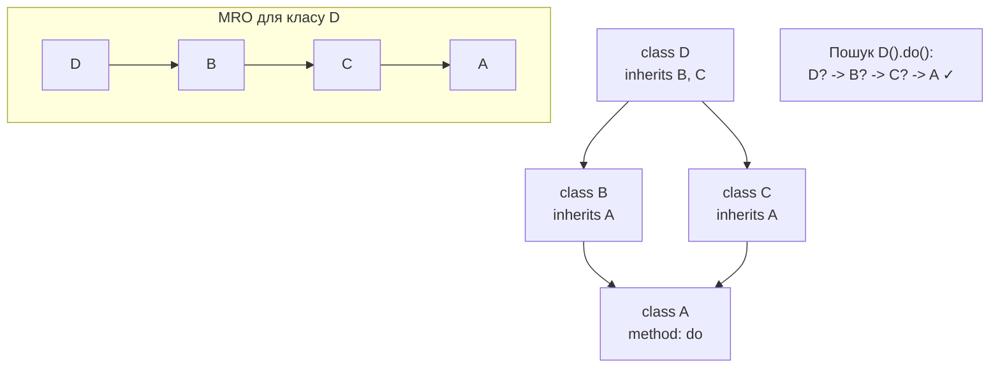
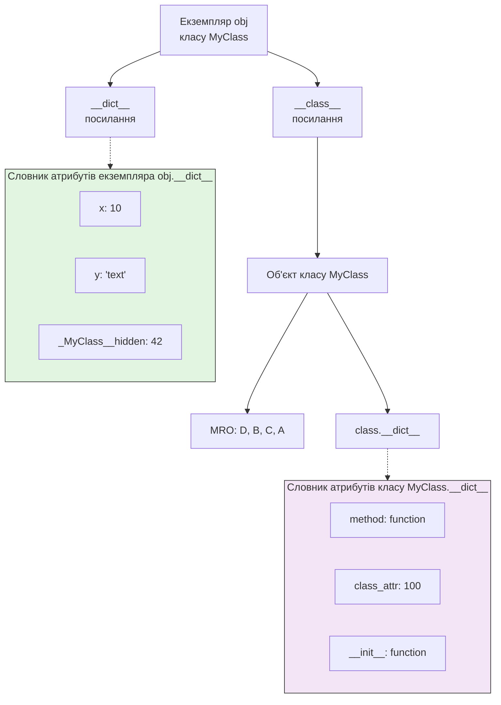

## РЕФЕРАТ: Об'єктно-орієнтоване програмування в Python: особливості реалізації, потужні механізми та фундаментальні компроміси
**Виконав:** *МАЧУЛА К.К., 343 Н.Г*

> **Анотація:**
> Об'єктно-орієнтована парадигма (ООП) є наріжним каменем сучасної розробки на Python, але її реалізація в цій динамічній мові кардинально відрізняється від класичних статичних мов, таких як Java чи C++. Цей звіт пропонує комплексний аналіз архітектури ООП в CPython, досліджуючи не лише базові принципи інкапсуляції, наслідування та поліморфізму, але й унікальні "пітонічні" механізми: від магічних методів (__dunder__) та дескрипторів до метакласів та динамічного MRO (Method Resolution Order). Дослідження розкриває, як динамічна природа Python — його найбільша сила для швидкої розробки прототипів та гнучкості — одночасно формує суттєві обмеження в контексті продуктивності, безпеки типів та підтримки великих корпоративних кодових баз. Особливу увагу приділено сучасним інструментам (dataclasses, type hints), які прагнуть пом'якшити ці обмеження, не руйнуючи при цьому філософію мови.

---

## Зміст

[Розділ 1. Філософія "Pythonic OOP": Все є об'єктом](#розділ-1-філософія-pythonic-oop-все-є-обєктом)

- [1.1 Принцип "Everything is an object" як фундамент](#11-принцип-everything-is-an-object-як-фундамент)

- [1.2 Динамічна модель: класи під час виконання](#12-динамічна-модель-класи-під-час-виконання)

- [1.3 Переосмислення принципів ООП в Python](#13-переосмислення-принципів-ооп-в-python)

[Розділ 2. Унікальні механізми та внутрішня архітектура](#розділ-2-унікальні-механізми-та-внутрішня-архітектура)

- [2.1 Магічні методи та протоколи: основа інтеграції](#21-магічні-методи-та-протоколи-основа-інтеграції)

- [2.2 MRO (C3 Linearization) та множинне наслідування](#22-mro-c3-linearization-та-множинне-наслідування)

- [2.3 Візуалізація ланцюжка MRO](#23-візуалізація-ланцюжка-mro)

- [2.4 Дескриптори: магія властивостей (property) та методів](#24-дескриптори-магія-властивостей-property-та-методів)

[Розділ 3. Просунуті концепції: влада над визначенням класів](#розділ-3-просунуті-концепції-влада-над-визначенням-класів)

- [3.1 type — метаклас за замовчуванням](#31-type--метаклас-за-замовчуванням)

- [3.2 Користувацькі метакласи: можливості та небезпеки](#32-користувацькі-метакласи-можливості-та-небезпеки)

- [3.3 Абстрактні класи (ABC) та формалізація інтерфейсів](#33-абстрактні-класи-abc-та-формалізація-інтерфейсів)

[Розділ 4. Обмеження та архітектурні компроміси](#розділ-4-обмеження-та-архітектурні-компроміси)

- [4.1 Інкапсуляція як угода, а не примус](#41-інкапсуляція-як-угода-а-не-примус)

- [4.2 Втрати продуктивності: ціна динамічності](#42-втрати-продуктивності-ціна-динамічності)

- [4.3 Складність рефакторингу та супроводу](#43-складність-рефакторингу-та-супроводу)

- [4.4 Візуалізація структури екземпляра в пам'яті CPython](#44-візуалізація-структури-екземпляра-в-памяті-cpython)

[Розділ 5. Еволюція та майбутнє: пом'якшення обмежень](#розділ-5-еволюція-та-майбутнє-помякшення-обмежень)

- [5.1 Аннотації типів (type hints): запобіжний захід](#51-аннотації-типів-type-hints-запобіжний-захід)

- [5.2 @dataclass: революція в шаблонному коді](#52-dataclass-революція-в-шаблонному-коді)

- [5.3 __slots__: оптимізація пам'яті за ціною динамічності](#53-slots-оптимізація-памяті-за-ціною-динамічності)

- [5.4 Висновки: Pythonic OOP — це про гнучкість, а не догмати](#54-висновки-pythonic-oop--це-про-гнучкість-а-не-догмати)

---

## Розділ 1. Філософія "Pythonic OOP": Все є об'єктом

### 1.1 Принцип "Everything is an object" як фундамент
Вся система ООП в Python будується на абсолютному принципі: будь-яка сутність у мові є об'єктом. Це означає, що не лише екземпляри користувацьких класів, але й самі класи, функції, модулі, навіть літерали (7, "hello", None) — все це об'єкти з ідентифікатором (id()), типом (type()) та можливими атрибутами.

Клас як об'єкт: Клас MyClass є екземпляром метакласу (зазвичай type). Його можна передавати в функції, присвоювати змінним, модифікувати.

Успадкування від вбудованих типів: Можна створити власний SuperList, що наслідується від list, і розширити його. Це практичне втілення утиної типізації (duck typing): об'єкт визначається своєю поведінкою (методами), а не формальним типом.

### 1.2 Динамічна модель: класи під час виконання
На відміну від статичних мов, де класи "фіксуються" під час компіляції, в Python класи створюються динамічно під час виконання. Оператор class — це синтаксичний цукор для виклику метакласу.

Тіло класу виконується в новому просторі імен.

Результати (атрибути, методи) збираються у словник.

Викликається метаклас (наприклад, type) з ім'ям класу, списком батьків та цим словником для створення об'єкта-класу.

Це відкриває шлях для неймовірної гнучкості: класи можна створювати програмно, модифікувати методами на льоту (Monkey Patching), що критично важливо для таких фреймворків, як Django або SQLAlchemy.

### 1.3 Переосмислення принципів ООП в Python
Python пропонує свою, прагматичну інтерпретацію класичних принципів:

| Принцип | Класична реалізація (Java/C++) | "Pythonic" реалізація |
| :--- | :--- | :--- |
| **Інкапсуляція** | Строгі модифікатори доступу (`private`, `protected`), контроль на рівні компілятора. | Угода на основі імен. `_protected`, `__private` (Name Mangling). Доступ до "приватного" все ще можливий, але ускладнений. Акцент на довірі до розробника. |
| **Наслідування** | Зазвичай одинарне, інтерфейси для множинного. | Повноцінне множинне наслідування. Вирішення конфліктів через алгоритм C3 (MRO). |
| **Поліморфізм** | Досягається через наслідування класів або реалізацію інтерфейсів. | Утина типізація. Будь-який об'єкт з методом `__len__()` може бути переданий у `len()`. Формальні інтерфейси не обов'язкові. |

## Розділ 2. Унікальні механізми та внутрішня архітектура

### 2.1 Магічні методи та протоколи: основа інтеграції
Справжня потужність ООП в Python прихована в магічних (dunder) методах — спеціальних методах, які інтерпретатор викликає автоматично в певних ситуаціях. Вони формують протоколи, що роблять користувацькі типи повноправними громадянами мови.

Протокол ітератора: __iter__(), __next__().

Протокол контекстного менеджера: __enter__(), __exit__() (для with).

Протокол виклику: __call__() (робить екземпляр функцією).

Протоколи колекцій: __getitem__(), __setitem__(), __len__().

Це дозволяє створювати типи, що інтегруються з мовою так само природно, як вбудовані. Наприклад, реалізація __getitem__ і __len__ робить об'єкт ітерабельним і здатним працювати з циклом for.

### 2.2 MRO (C3 Linearization) та множинне наслідування
Множинне наслідування в Python — не архаїзм, а потужний інструмент, що вимагає чітких правил для уникнення "діамантової проблеми". Алгоритм C3 Linearization будує лінійний порядок класів (MRO), який задовольняє двом умовам:

Локальний порядок класів зберігається.

Будь-який клас з'являється в MRO лише один раз і після всіх своїх предків.

Цей порядок визначається при створенні класу і зберігається в атрибуті ClassName.__mro__. Пошук атрибута (obj.attr) відбувається саме за цим списком.

### 2.3 Візуалізація ланцюжка MRO
Діаграма, що ілюструє "діамантову" проблему наслідування та її вирішення за допомогою алгоритму C3 у Python.



Пояснення: При виклику D().do() інтерпретатор шукає метод do, рухаючись за списком MRO: спочатку в класі D, потім у B, потім у C, і лише потім у A. Це забезпечує детерміновану поведінку навіть у складних ієрархіях.

### 2.4 Дескриптори: магія властивостей (property) та методів
Дескриптори — це механізм нижчого рівня, що лежить в основі властивостей, статичних методів та методів класу. Дескриптор — це будь-який об'єкт, який реалізує хоча б один із методів __get__(), __set__() або __delete__().

Властивість (property): Це дескриптор найвищого рівня. Він дозволяє замінити простий доступ до атрибута (obj.attr) на виклик функцій-геттера/сеттера, зберігаючи чистий синтаксис.

```python
class Circle:
    def __init__(self, radius):
        self._radius = radius # "Приватний" атрибут

    @property
    def radius(self):  # Геттер
        return self._radius

    @radius.setter     # Сеттер
    def radius(self, value):
        if value <= 0:
            raise ValueError("Радіус має бути додатнім")
        self._radius = value

    @property          # Обчислювана властивість
    def area(self):
        return 3.14 * self._radius ** 2
```
Це елегантний спосіб інкапсуляції логіки валідації та обчислення.

## Розділ 3. Просунуті концепції: влада над визначенням класів
### 3.1 type — метаклас за замовчуванням
Якщо клас — це креслення для об'єктів, то метаклас — це креслення для класів. У Python вбудований клас type є метакласом за замовчуванням для всіх класів.

` *type(об'єкт)* повертає клас об'єкта.

` *type(ім'я, батьки, атрибути)* динамічно створює новий клас. Це те, що робить інтерпретатор під капотом при виконанні class.

### 3.2 Користувацькі метакласи: можливості та небезпеки
Створюючи власний метаклас (наслідуючись від type), розробник може перехопити момент створення класу і змінити його.

Застосування: Автоматична реєстрація підкласів, перевірка атрибутів, додавання методів за шаблоном, створення ORM (моделі Django).

Ризик: Значно ускладнює код, важко налагоджувати. Відома ідіома спільноти: "Якщо ви не впевнені, чи потрібен вам метаклас, то він вам точно не потрібен".

### 3.3 Абстрактні класи (ABC) та формалізація інтерфейсів
Для тих, кому потрібна більша строгість, ніж утина типізація, Python пропонує модуль abc (Abstract Base Classes). Абстрактний клас не можна інстанціювати. Він визначає контракт — набір методів (@abstractmethod), які повинні бути реалізовані в підкласі.

```python
from abc import ABC, abstractmethod

class DataExporter(ABC):
    @abstractmethod
    def export(self, data, destination):
        pass

class JSONExporter(DataExporter):
    def export(self, data, destination):
        # Must implement!
        pass
```
Це надає перевірку на етапі створення класу, а не під час виконання.

## Розділ 4. Обмеження та архітектурні компроміси
### 4.1 Інкапсуляція як угода, а не примус
Найбільша відмінність від статичних мов — відсутність справжнього захисту даних. Пошук атрибута — це динамічна операція через __dict__. Навіть "приватні" атрибути (__attr) доступні через _ClassName__attr. Це робить Python менш придатним для систем з жорсткими вимогами безпеки, де стан об'єкта повинен бути закритим.

### 4.2 Втрати продуктивності: ціна динамічності
Гнучкість ООП в Python має свою ціну в циклах процесора та байтах пам'яті:

Доступ до атрибутів: Кожен obj.attr — це пошук у хеш-таблиці (__dict__), потім пошук у MRO класів. Це на порядки повільніше, ніж статичне зв'язування або доступ до фіксованого зміщення в пам'яті.

Вирівнювання методів (Method Dispatch): Виклик методу — це складний процес, що включає створення об'єкта-методу, прив'язку до екземпляра (bound method) і динамічний виклик.

Пам'ять: Кожен об'єкт несе на собі словник атрибутів (__dict__). Для мільйонів простих об'єктів (наприклад, точок у просторі) це неефективно.

### 4.3 Складність рефакторингу та супроводу
Динамічна природа ускладнює роботу з великими кодовими базами:

Статичний аналіз: Інструменти типу mypy можуть лише наближено аналізувати типи. Рефакторинг (перейменування приватного методу) може не бути виявлений, якщо метод викликається через getattr().

Монкі-патчінг: Можливість змінювати класи під час виконання може призвести до непередбачуваних побічних ефектів і ускладнити відлагодження.

Зрозумілість коду: Щоб зрозуміти, які атрибути є в об'єкта, іноді потрібно простежити весь шлях виконання програми, а не просто подивитися оголошення класу.

### 4.4 Візуалізація структури екземпляра в пам'яті CPython
Діаграма внутрішньої організації екземпляра класу, що демонструє джерело накладних витрат.


Пояснення: Кожен екземпляр (obj) містить посилання на свій клас та словник власних атрибутів. Клас має власний словник методів та статичних атрибутів і посилання на ланцюжок предків (MRO). Пошук obj.attr — це спочатку пошук в obj.__dict__, потім в MyClass.__dict__, потім в словниках класів з MRO. Кожен такий пошук — це операція з хеш-таблицею, що і є джерелом накладних витрат.

## Розділ 5. Еволюція та майбутнє: пом'якшення обмежень
### 5.1 Аннотації типів (type hints): запобіжний захід
Введені в Python 3.5+, анотації типів — це спроба систематизувати динамічну природу мови, не втрачаючи її переваг.

```python
from typing import List

class UserService:
    def get_active_users(self) -> List['User']:
        return [u for u in self.db.get_all() if u.is_active]
```
Переваги: Покращує документацію, дозволяє IDE забезпечувати точне автодоповнення та перевірку типів, дає змогу використовувати статичні аналізатори (mypy).

Обмеження: Це підказки для розробника та інструментів. Інтерпретатор CPython ігнорує їх під час виконання. Вони не надають ні додаткового захисту, ні оптимізації продуктивності.

### 5.2 @dataclass: революція в шаблонному коді
Модуль dataclasses (Python 3.7+) кардинально спрощує створення класів, основним призначенням яких є зберігання даних (Data Transfer Objects, моделі).

```python
from dataclasses import dataclass, field
from typing import List

@dataclass(order=True, frozen=True)
class Transaction:
    tx_id: int
    amount: float
    currency: str = "USD"
    tags: List[str] = field(default_factory=list)
```
Декоратор автоматично генерує __init__(), __repr__(), __eq__(), а за необхідності — __lt__(), __hash__() тощо. Це усуває тонни шаблонного, схильного до помилок коду, зберігаючи всі можливості ООП.

### 5.3 __slots__: оптимізація пам'яті за ціною динамічності
Для критичних до пам'яті класів існує атрибут __slots__. Він замінює динамічний __dict__ на фіксований набір дескрипторів для атрибутів.

```python
class Point:
    __slots__ = ('x', 'y') # Фіксований набір атрибутів
    
    def __init__(self, x, y):
        self.x = x
        self.y = y
```
Перевага: Резке зменшення споживання пам'яті та пришвидшення доступу до атрибутів.

Недолік: Втрата динамічності: неможливо додавати нові атрибути, використовувати слабкі посилання (weakref) без явного додавання до __slots__.

---

### 5.4 Висновки: Pythonic OOP — це про гнучкість, а не догмати
ООП в Python — це не догматичне слідування канонам, а прагматичний інструментарій. Мова не змушує використовувати ООП для всього, а пропонує його там, де це доречно, часто поєднуючи з функціональними та процедурними підходами. Його основна сила — швидкість розробки та експресівність, що досягається через динамічність і метапрограмування.

Обмеження (слабка інкапсуляція, накладні витрати на динамічність) є прямою ціною за цю свободу. Сучасний розвиток Python (type hints, dataclasses, __slots__) показує шлях еволюції: не відмова від динамічності, а надання розробникам інструментів для самодисципліни та оптимізації там, де це необхідно, дозволяючи зберігати творчу свободу в прототипах та скриптах.

Таким чином, ООП в Python — це не "погана" версія Java, а унікальна модель, оптимізована під свої цілі: читабельність, швидкість розробки та неймовірну адаптивність.

Ось варіант висновку, який стилістично та змістовно відповідає наданому тексту реферату. Він узагальнює основні тези та підводить підсумок дослідження архітектурних компромісів Python.
